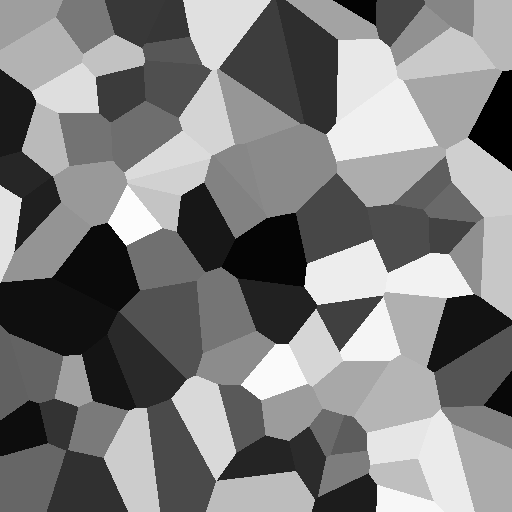
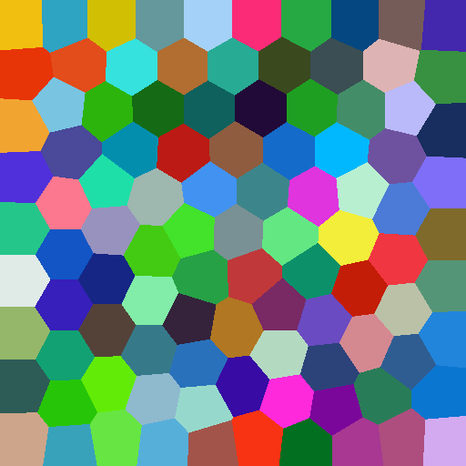

# JFA & CVT using [Taichi Programming Language](https://github.com/taichi-dev/taichi)

2D/3D Voronoi tessellation using Jump Flooding algorithm(JFA). Adopt 1+JFA strategy to reduce errors.

2D Centroidal Voronoi Tessellation using Lloyd algorithm.

# Usage

**2D JFA solver**

```python
from JFA import jfa_solver_2D
jfa2d = jfa_solver_2D(width, height, sites)
```

* ```width```,```height``` define the resolution of 2D texture.
* ```sites``` is a numpy array that only stores the location information of all sites. The shape should be ```(num_site, 2)```.

```python
jfa2d.solve_jfa(init_step)
```

* ```init_step``` (tuple) the initial step length of JFA. Usually,``` init_step``` is ). To reduce the computation time incurred by unnecessary JFA passes, ```init_step``` can be set to  ).

**3D JFA solver**

```python
from JFA import jfa_solver_3D
jfa3d = jfa_solver_3D(width, height, length, sites)
jfa3d.solve_jfa(step)
```

* all parameters are similar to ```jfa_solver_2D```. 

Output result or each step

```python
# 2D / 3D output
# Render the result into screen based on the index of each pixel and site_info
jfa2d.render_color(screen, site_info)
jfa3d.debug_slice(screen, site_info, z_index)
# each step, remember to call init_sites before call jfa_step()
jfa2d.jfa_step(step_x, step_y)
jfa3d.jfa_step(step_x, step_y, step_z)
```

* ```screen```: 
  * 2D:```ti.field(shape=(w,h,3))``` , where 3 is for ```(r,g,b)``` channels. 
  * 3D:```ti.field(shape=(w,h,l,3))```.
* ```site_info```: a numpy array holds other information of all sites. (ie. color).
* ```step_x```,```step_y```,```step_z``` : Step size of each JFA pass(assigned manually).

**2D CVT solver**

```python
from CVT_Lloyd import cvt_lloyd_solver_2D

cvt_solver = cvt_lloyd_solver_2D(width, height, sites)
cvt_solver.solve_cvt()
cvt_solver.jfa.render_color(screen, site_info)
```

* parameters are similar to ```jfa_solver_2d```
* ```solve_cvt()``` will use ) as initial step size.
* Call the function ```render_color``` of member variable ```jfa``` of ```cvt_lloyd_solver_2d```  to output the result.

## Results

2D JFA & CVT: 512x512, 100 sites, initial step size=(128,128)

|JFA|CVT|

|:---:|:---:|

 | 


3D JFA: 512x512x512, 50 sites, initial step size=(256,256,256).


Each slice of the result (3D texture) is shown as GIF above.(shifting z index from 0 to 511)

## Performance

I use [Taichi KernelProfiler](https://taichi.readthedocs.io/en/stable/profiler.html) to output the detailed statistics.

Environment: Intel i7 9700K (CPU 3.6 GHZ) and NVidia RTX 2060 SUPER GPU

* 512x512 JFA, 100 sites, initial step size=(128,128)

  ```
  CUDA Profiler
  =========================================================================
  [      %     total   count |      min       avg       max   ] Kernel name
  [ 99.48%   0.098 s      1x |   97.580    97.580    97.580 ms] runtime_initialize
  [  0.23%   0.000 s      8x |    0.022     0.028     0.037 ms] jfa_step_c8_0_kernel_6_range_for
  [  0.11%   0.000 s     10x |    0.006     0.011     0.018 ms] jit_evaluator_0_kernel_2_serial
  [  0.04%   0.000 s      1x |    0.041     0.041     0.041 ms] runtime_initialize2
  [  0.04%   0.000 s      1x |    0.037     0.037     0.037 ms] matrix_to_ext_arr_c34_0_kernel_8_range_for
  [  0.03%   0.000 s      2x |    0.016     0.016     0.016 ms] jit_evaluator_1_kernel_3_serial
  [  0.03%   0.000 s      1x |    0.031     0.031     0.031 ms] render_color_c10_0_kernel_7_range_for
  [  0.01%   0.000 s      1x |    0.013     0.013     0.013 ms] init_sites_c4_0_kernel_4_range_for
  [  0.01%   0.000 s      1x |    0.009     0.009     0.009 ms] ext_arr_to_matrix_c36_0_kernel_0_range_for
  [  0.01%   0.000 s      1x |    0.009     0.009     0.009 ms] ext_arr_to_matrix_c36_1_kernel_1_range_for
  [  0.01%   0.000 s      1x |    0.006     0.006     0.006 ms] init_sites_c4_0_kernel_5_range_for
  -------------------------------------------------------------------------
  [100.00%] Total kernel execution time:   0.098 s   number of records: 11
  =========================================================================
  ```

  Actual computation time: 0.997ms

* 512x512 CVT, 100 sites, initial step size=(128,128)

  ```
  iteration times: 250
  CUDA Profiler
  =========================================================================
  [      %     total   count |      min       avg       max   ] Kernel name
  [ 29.50%   0.098 s   2008x |    0.024     0.049     0.156 ms] jfa_step_c8_0_kernel_6_range_for
  [ 28.56%   0.095 s      1x |   94.816    94.816    94.816 ms] runtime_initialize
  [ 25.76%   0.085 s    251x |    0.293     0.341     0.404 ms] compute_centroids_c18_0_kernel_8_range_for
  [  2.64%   0.009 s    251x |    0.016     0.035     0.073 ms] cvt_convergence_check_c20_0_kernel_11_range_for
  [  2.58%   0.009 s    251x |    0.016     0.034     0.082 ms] compute_centroids_c18_0_kernel_9_range_for
  [  2.53%   0.008 s    251x |    0.015     0.033     0.073 ms] cvt_convergence_check_c20_0_kernel_12_serial
  [  2.49%   0.008 s    251x |    0.014     0.033     0.083 ms] cvt_convergence_check_c20_0_kernel_10_serial
  [  2.11%   0.007 s    251x |    0.011     0.028     0.065 ms] compute_centroids_c18_0_kernel_7_range_for
  [  1.49%   0.005 s    251x |    0.016     0.020     0.057 ms] init_sites_c4_0_kernel_4_range_for
  [  1.23%   0.004 s    251x |    0.008     0.016     0.063 ms] init_sites_c4_0_kernel_5_range_for
  [  0.97%   0.003 s    250x |    0.010     0.013     0.017 ms] assign_sites_c6_0_kernel_13_range_for
  [  0.08%   0.000 s     16x |    0.008     0.017     0.034 ms] jit_evaluator_0_kernel_2_serial
  [  0.01%   0.000 s      1x |    0.041     0.041     0.041 ms] runtime_initialize2
  [  0.01%   0.000 s      1x |    0.037     0.037     0.037 ms] ext_arr_to_matrix_c36_0_kernel_0_range_for
  [  0.01%   0.000 s      1x |    0.037     0.037     0.037 ms] render_color_c10_0_kernel_14_range_for
  [  0.01%   0.000 s      1x |    0.036     0.036     0.036 ms] matrix_to_ext_arr_c34_0_kernel_15_range_for
  [  0.01%   0.000 s      2x |    0.014     0.015     0.016 ms] jit_evaluator_1_kernel_3_serial
  [  0.01%   0.000 s      1x |    0.017     0.017     0.017 ms] ext_arr_to_matrix_c36_1_kernel_1_range_for
  -------------------------------------------------------------------------
  [100.00%] Total kernel execution time:   0.332 s   number of records: 18
  =========================================================================
  ```

  Time: 0.236s (without using the scheme [GPU-CVT](https://personal.utdallas.edu/~xxg061000/GPU-CVT.pdf) described in Sec.3.1 to further improve the JFA performance).

* 512x512x512 JFA3D, 50 sites, initial step size=(256,256,256).

  ```
  CUDA Profiler
  =========================================================================
  [      %     total   count |      min       avg       max   ] Kernel name
  [ 89.95%   0.863 s      9x |   30.492    95.936   157.981 ms] jfa_step_c14_0_kernel_4_range_for
  [  9.88%   0.095 s      1x |   94.821    94.821    94.821 ms] runtime_initialize
  [  0.15%   0.001 s      1x |    1.418     1.418     1.418 ms] init_sites_c12_0_kernel_2_range_for
  [  0.01%   0.000 s     12x |    0.006     0.008     0.016 ms] runtime_retrieve_and_reset_error_code
  [  0.01%   0.000 s      1x |    0.059     0.059     0.059 ms] runtime_initialize2
  [  0.00%   0.000 s      1x |    0.016     0.016     0.016 ms] ext_arr_to_matrix_c32_0_kernel_0_range_for
  [  0.00%   0.000 s      1x |    0.008     0.008     0.008 ms] init_sites_c12_0_kernel_3_range_for
  [  0.00%   0.000 s      1x |    0.007     0.007     0.007 ms] ext_arr_to_matrix_c32_1_kernel_1_range_for
  -------------------------------------------------------------------------
  [100.00%] Total kernel execution time:   0.960 s   number of records: 8
  =========================================================================
  ```

  Time: 0.864ms

# Reference

[Jump flooding in GPU with applications to Voronoi diagram and distance transform](http://citeseerx.ist.psu.edu/viewdoc/download?doi=10.1.1.101.8568&rep=rep1&type=pdf)

[GPU-Assisted Computation of Centroidal Voronoi Tessellation](https://personal.utdallas.edu/~xxg061000/GPU-CVT.pdf)

[Variants of Jump Flooding Algorithm for Computing Discrete Voronoi Diagrams](https://ieeexplore.ieee.org/stamp/stamp.jsp?tp=&arnumber=4276119)

